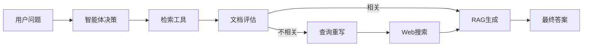

# LangChain × OceanBase: Agentic RAG 实战课程

[](https://www.langchain.com)
[](https://www.oceanbase.com)
[](https://python.org)

这是一个系统性的实战课程，教授如何使用 **LangChain** 与 **OceanBase** 数据库构建智能体驱动的检索增强生成（Agentic RAG）系统。课程涵盖从基础的RAG概念到高级的Corrective RAG技术。

## 🎯 课程概述

本课程由 **沧海九粟** 主讲，结合了最新的LangChain v1中间件技术和OceanBase分布式数据库特性，提供了完整的从理论到实践的学习路径。

### 核心学习目标

- 掌握RAG（检索增强生成）的基础原理和架构
- 理解Agentic RAG的智能体决策机制
- 实现具备自我评估和纠错能力的Corrective RAG
- 熟练使用LangChain v1的中间件系统
- 集成OceanBase数据库进行向量存储和检索

## 📚 课程结构

### 渐进式学习路径

| 章节 | 文件名 | 主要内容 | 难度 |
|------|--------|----------|------|
| **第0章** | `00-introduction-to-rag.ipynb` | RAG基础概念与环境配置 | ⭐ 入门 |
| **第1章** | `01-building-knowledge-base.ipynb` | 知识库构建与向量化存储 | ⭐⭐ 基础 |
| **第2章** | `02-two-step-rag.ipynb` | 传统两步RAG实现 | ⭐⭐ 基础 |
| **第3章** | `03-agentic-rag.ipynb` | 智能体RAG架构设计 | ⭐⭐⭐ 中级 |
| **第4章** | `04-corrective-rag.ipynb` | 纠错型RAG（CRAG）实战 | ⭐⭐⭐⭐ 高级 |

### 详细课程内容

#### 🔰 第0章：RAG入门介绍
- **学习目标**：建立RAG基础认知，配置开发环境
- **核心内容**：
  - RAG技术背景和局限性分析
  - 三种RAG架构对比（2-Step、Agentic、Hybrid）
  - SiliconFlow API和OceanBase环境配置
  - SeekDB数据库管理界面使用

#### 🏗️ 第1章：构建知识库
- **学习目标**：掌握文档预处理和向量化存储
- **核心内容**：
  - 多种文档格式加载（PDF、网页、文本）
  - 智能分块策略（RecursiveCharacterTextSplitter）
  - 向量嵌入和存储配置
  - OceanBase向量数据库操作

#### ⚡ 第2章：两步RAG
- **学习目标**：实现基础RAG工作流
- **核心内容**：
  - 检索（Retrieval）和生成（Generation）分离
  - 向量相似性搜索实现
  - 基础RAG链构建
  - 性能优化策略

#### 🤖 第3章：智能体RAG
- **学习目标**：设计具备决策能力的RAG系统
- **核心内容**：
  - LangChain Agent架构设计
  - 工具链集成和调用
  - 动态决策逻辑实现
  - 多轮对话和状态管理

#### 🛡️ 第4章：纠错型RAG（重点）
- **学习目标**：构建自我评估和纠错的RAG系统
- **核心内容**：
  - Corrective RAG（CRAG）架构原理
  - LangChain v1中间件系统深度应用
  - 文档相关性评估算法
  - Web搜索后备机制
  - 两种中间件风格对比（Wrap-Style vs Node-Style）

## 🛠️ 技术栈

### 核心技术
- **LangChain v1**: LLM应用开发框架
- **OceanBase**: 分布式向量数据库
- **Python 3.11+**: 编程语言
- **SiliconFlow**: LLM模型服务

### 关键依赖
```python
langchain>=0.3.0
langchain-openai
langchain-community
oceanbase-ce
chromadb  # 向量数据库
uv  # 快速包管理器
jupyter  # 交互式开发环境
```

### 中间件系统
- `wrap_tool_call`: 工具调用包装
- `before_model`: 模型前置处理
- `wrap_model_call`: 模型调用包装

## 🚀 快速开始

### 环境要求

- **Python 3.11+** （必需）
- **OceanBase** 数据库实例
- **SiliconFlow API** 密钥
- **8GB+** 可用内存

### 安装步骤

#### 1. 克隆仓库
```bash
git clone https://github.com/masx200/langchain-course-oceanbase
cd langchain-course-oceanbase
```

#### 2. 安装uv包管理器
```bash
# macOS & Linux
curl -LsSf https://astral.sh/uv/install.sh | sh

# Windows (PowerShell)
powershell -c "irm https://astral.sh/uv/install.ps1 | iex"

# 备用方案
pip install uv
```

#### 3. 创建虚拟环境
```bash
# 使用uv创建并激活虚拟环境
uv venv --python 3.11
source .venv/bin/activate  # Linux/macOS
# 或
.venv\Scripts\activate  # Windows
```

#### 4. 安装依赖
```bash
uv sync
```

#### 5. 配置环境变量
创建 `.env` 文件：
```bash
# OceanBase配置
OB_HOST=localhost
OB_PORT=2881
OB_USER=root
OB_PASSWORD=your_password
OB_DATABASE=test

# SiliconFlow API
SILICONFLOW_API_KEY=your_api_key
OPENAI_API_KEY=your_openai_key

# 其他配置
LANGCHAIN_TRACING_V2=true
LANGCHAIN_API_KEY=your_langchain_key
```

#### 6. 启动Jupyter
```bash
jupyter notebook
```

### 🗃️ 数据库设置

#### OceanBase SeekDB
1. **启动OceanBase服务**
2. **访问SeekDB仪表板**：`http://localhost:8080`
3. **验证连接**：在课程notebook中测试数据库连接
4. **创建向量表**：运行初始化脚本

## 📖 使用说明

### 学习顺序建议
1. **按章节顺序学习**：建议严格按照 `00` → `01` → `02` → `03` → `04` 的顺序
2. **理论结合实践**：每个章节都包含概念讲解和代码实现
3. **动手实验**：运行提供的Jupyter Notebook进行实际操作
4. **扩展练习**：尝试修改参数和代码来加深理解

### 课程资源
- **📊 幻灯片**：`slides.pdf`, `slides-1.pdf`, `slides-2.pdf`
- **📄 示例数据**：`nke-10k-2023.pdf` (Nike年度财务报告)
- **💻 代码实现**：完整的Jupyter Notebook示例

### 实验环境
- **推荐配置**：16GB RAM，多核CPU
- **存储空间**：至少10GB可用空间
- **网络要求**：稳定的互联网连接（API调用）

## 🏆 核心特性

### Corrective RAG (CRAG) 技术亮点

#### 🔄 自我评估机制
```python
# 文档相关性评估
def grade_document_relevance(question, document):
    """评估文档与问题的相关性"""
    # 使用LLM进行二元分类 (yes/no)
    # 过滤不相关文档
```

#### 🛡️ 智能后备策略
```python
# 条件路由逻辑
if all_documents_irrelevant:
    trigger_web_search_fallback()
else:
    proceed_with_rag_generation()
```

#### 🔧 中间件架构
- **Wrap-Style**: 包装式中间件，直接拦截函数调用
- **Node-Style**: 节点式中间件，基于图状态管理

### Agentic RAG 工作流



## 📈 学习成果

完成本课程后，您将能够：

✅ **理论掌握**
- 深入理解RAG技术演进历程
- 掌握Agentic RAG的设计哲学
- 理解Corrective RAG的纠错机制

✅ **实践技能**
- 使用LangChain构建复杂LLM应用
- 集成OceanBase进行向量数据管理
- 实现智能体决策和工具链编排

✅ **工程能力**
- 设计可扩展的RAG架构
- 实现自我评估和纠错机制
- 优化RAG系统性能和准确性

## 🤝 贡献指南

欢迎提交Issues和Pull Requests来改进课程内容：

1. **Fork** 本仓库
2. **创建**特性分支 (`git checkout -b feature/AmazingFeature`)
3. **提交**更改 (`git commit -m 'Add some AmazingFeature'`)
4. **推送到**分支 (`git push origin feature/AmazingFeature`)
5. **开启**Pull Request

### 贡献方向
- 📝 完善文档和注释
- 🐛 修复代码问题
- ✨ 添加新的示例和练习
- 🌐 多语言翻译支持

## 📄 许可证

本项目采用 [MIT License](LICENSE) 开源协议。

## 🙏 致谢

- **主讲人**: 沧海九粟
- **技术支持**: LangChain团队、OceanBase团队
- **课程网站**: https://langchain-course-oceanbase.netlify.app/
- **参考资料**: [LangChain官方文档](https://python.langchain.com)、[OceanBase文档](https://www.oceanbase.com/docs)

## 📞 支持与反馈

- **课程讨论**: 在GitHub Issues中提问
- **技术交流**: 欢迎提交代码改进建议
- **学习反馈**: 分享学习心得和项目应用案例

---

**⭐ 如果这个课程对您有帮助，请给仓库点个Star！**

*Happy Learning! 🚀*